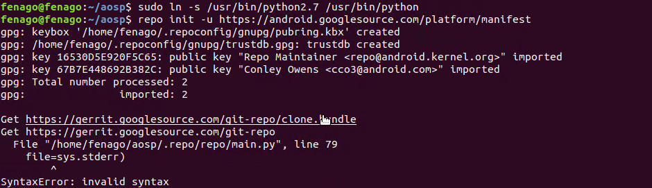
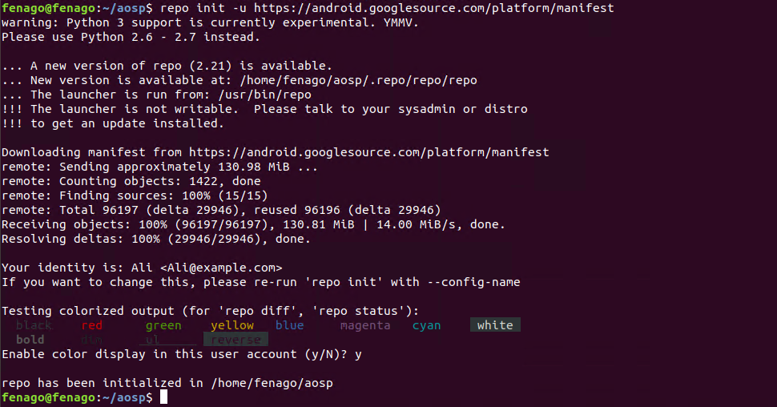

Downloading the Source
======================

The Android source tree is located in a Git repository hosted by Google.
The Git repository includes metadata for the Android source, including
changes to the source and when the changes were made. This page
describes how to download the source tree for a specific Android code
line.


Initializing a Repo client
--------------------------

After installing the Repo Launcher, set
up your client to access the Android source repository:

1.  Create an empty directory to hold your working files. Give it any
    name you like:

    

    ```
    cd ~
    mkdir aosp
    cd aosp
    ```

2.  Configure Git with your real name and email address. To use the
    Gerrit code-review tool, you need an email address that\'s connected
    with a [registered Google
    account](https://www.google.com/accounts). Ensure that
    this is a live address where you can receive messages. The name that
    you provide here shows up in attributions for your code submissions.

    

    ```
    git config --global user.name Your Name
    git config --global user.email you@example.com
    ```

3.  Run the following command(s) in the terminal:

    ```
    sudo rm /usr/bin/python

    sudo ln -s /usr/bin/python2.7 /usr/bin/python

    repo init -u https://android.googlesource.com/platform/manifest
    ```



**Note:** You will get error in repo init. You can ignore the error for now.

4. Run the following command in the terminal to create symlink for `python3`:

    ```
    sudo rm /usr/bin/python

    sudo ln -s /usr/bin/python3 /usr/bin/python
    ```


4.  Run `repo init` to get the latest version
    of Repo with its most recent bug fixes. You must specify a URL for
    the manifest, which specifies where the various repositories
    included in the Android source are placed within your working
    directory.


    ```
    repo init -u https://android.googlesource.com/platform/manifest
    ```

**Note:**

A successful initialization ends with a message stating that Repo is
initialized in your working directory. Your client directory now
contains a `.repo` directory where files such
as the manifest are kept.




[ Downloading the Android source tree ]
---------------------------------------


More rarely, Linux clients experience connectivity issues, getting stuck
in the middle of downloads (typically during *receiving objects*).
Adjusting the settings of the TCP/IP stack and using non-parallel
commands can improve the situation. You must have root access to modify
the TCP setting.

To download the Android source tree to your working directory from the
repositories as specified in the default manifest, run:


```
sudo sysctl -w net.ipv4.tcp_window_scaling=0
repo sync -j1
```

The Android source files are downloaded in your working directory under
their project names.

**Note:** To suppress output, pass the `-q` (quiet) flag.

