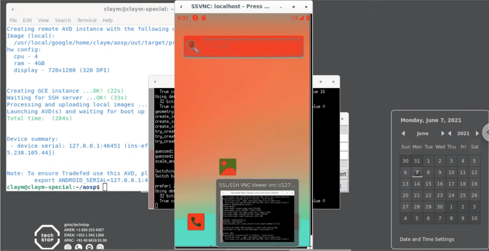

Android Developer Codelab
=========================


You can help develop the most widely installed operating system in the
history of Earth. Yes, you\'re here to embark upon the journey of
becoming an Android platform engineer.

Although the path is challenging, the Android team strives to simplify
your journey, every release. And the team makes improvements every day
through direct work in the Android Open Source Project (AOSP).

So sit back, fire up a terminal, and let\'s make history.

[Goals]
-------------------------------------------------------

The mission of this codelab is:

1.  To give you a idea of what the developer workflow is like for
    Android engineers working on the platform (the operating system).


[Environment]
-------------------------------------------------------------

Typically, users build and develop on the workstation directly. Because
you may be working in various terminals, and many of the commands used
are terminal-specific, you will need to rerun them in each terminal
session. Specifically, these include the
`source build/envsetup.sh` and
`lunch` commands.


[Build the code]
----------------------------------------------------------------

To build Android, you must select a
[target](https://source.android.com/setup/build/building#choose-a-target)
device type to build with the `lunch` command.
A target is a device permutation, such as a specific model or form
factor.

The device target included below,
`aosp_cf_x86_64_phone-userdebug`, enables you
to build the
[Cuttlefish](https://source.android.com/setup/create/cuttlefish) virtual
Android device for testing without a physical device.

To build and update a physical device instead, choose another target and
follow the instructions for [flashing
devices](https://source.android.com/setup/build/running).

1.  Set up your environment for building Android devices by running the
    following command from the root of your source code checkout:

    

    ```
    cd ~/aosp
    
    source build/envsetup.sh
    ```

2.  Pass the build target to the lunch command, like this:

    

    ```
    lunch aosp_cf_x86_64_phone-userdebug
    ```

3.  [Build](https://source.android.com/setup/build/building#build-the-code)
    the code from anywhere in your checkout with:

    

    ```
    m
    ```

Expect the first build to take hours. Subsequent builds take
significantly less time.

[Create an Acloud instance]
---------------------------------------------------------------------------

[Acloud](https://android.googlesource.com/platform/tools/acloud/+/refs/heads/master/README.md)
is a command-line tool in AOSP that assists users in creating virtual
Android devices, in this case Cuttlefish.

If you\'re in the same terminal session used to [build the
code](https://source.android.com/setup/start#build_the_code), proceed.
Otherwise, rerun the `envsetup.sh` script and
the same `lunch` command you used there first.
Then

1.  Create an Acloud local instance with:

    

    ```
    acloud create --local-image --local-instance
    ```

2.  Accept updates to required packages.

3.  If prompted, restart your workstation for all changes to take
    effect.

4.  Select the Cuttlefish device.

You should be greeted with a VNC session containing an Android device!

You can interact with the virtual device on your workstation using your
mouse and keyboard. You can also follow the activity within the logs
while you use your device by employing the Android Debug Bridge (adb)
`logcat` command:


```
adb logcat
```

Make a change
-------------

Update the source code following this example
[changelist](https://android-review.googlesource.com/c/platform/frameworks/native/+/1181350).

1.  From the root of your checkout (`aosp/`
    directory), navigate to the `frameworks/native` Git project:

    

    ```
    cd frameworks/native
    ```

2.  Start a temporary project with this command:

    

    ```
    repo start <some-name> .
    ```

3.  Edit `SurfaceFlinger.cpp` to include the
    updates from the changelist at the following location:

    

    ```
    aosp/frameworks/native/services/surfaceflinger/SurfaceFlinger.cpp
    ```

4.  Find these two lines:

    

    ```
    postFrame();
    postComposition();
    ```

5.  Replace those two lines with the following:

    

    ```
    postFrame();
    postComposition();
    mClientColorMatrix = mat4(vec4,
                              vec4);
    updateColorMatrixLocked();
    ```

6.  Build the code:

    

    ```
    m
    ```

7.  Update the build on the device:

    

    ```
    adb root
    adb remount
    adb sync
    adb reboot
    acloud reconnect
    ```

8.  If you\'re prompted to select a device, choose the one that shows
    the shortest elapsed time. (This is probably the last one in the
    list you see.) To see all virtual device instances, use the
    `acloud list` and
    `acloud list -v` commands.

Verify that you see a color change on your selected device similar to
what shows in Figure 1.



**Figure 1.** Screen appearance after successful color change

[Test your code]
----------------------------------------------------------------

This portion of the codelab utilizes an example test that\'s in the
source tree and is failing. This employs
[Atest](https://source.android.com/compatibility/tests/development/atest)
for running the test locally and testing the code.

To use the test, follow these instructions:

1.  Run:

    

    ```
    atest DevCodelabTest
    ```

2.  The test will fail. To fix it, find the source code of the failing
    test:

    

    ```
    atest --info android.test.example.devcodelab.DevCodelabTest#testHelloWorld
    ```

3.  Then look here

    

    ```
    platform_testing/tests/example/devcodelab
    ```

4.  To get the file to edit, take the name of the test in
    `android.test.example.devcodelab.DevCodelabTest` and replace the `.` with
    `/`, to get this result:

    

    ```
    src/android/test/example/devcodelab/DevCodelabTest.java
    ```

5.  Then edit

    

    ```
    platform_testing/tests/example/devcodelab/src/android/test/example/devcodelab/DevCodelabTest.java
    ```

    to replace

    

    ```
    Assert.assertTrue(false)
    ```

    with

    

    ```
    Assert.assertTrue(true)
    ```

6.  Run the test again to verify you fixed the issue:

    

    ```
    atest DevCodelabTest
    ```

[Upload your code for review]
-----------------------------------------------------------------------------

Repo simplifies Git usage by bundling commands such as
`git clone` to work across numerous Git
repositories (or projects) at once.

See [Source Control Tools](https://source.android.com/setup/develop) for
overviews of Git and Repo, with links to full documentation on working
with Android source code. See the [AOSP
repository](https://android.googlesource.com/) for the full
list of Git projects and the individual projects (paths) for branches
associated with each project.

For code review of your projects in Git, you\'ll use the
[Gerrit](https://gerrit-review.googlesource.com/Documentation/)
web-based code review system.

**Important:** Ensure that you\'re signed into Gerrit to view and
respond to changes.

1.  Assuming you made your changes in the
    `frameworks/native` project, run these
    commands to upload them:

    

    ```
    cd frameworks/native
    repo start codelab .
    git add .
    git commit
    ```

2.  For your commit message, enter the following:

    

    ```
    Android codelab change
    Test: manual atest
    ```

3.  Upload your change:

    

    ```
    repo upload
    ```

If you\'re successful, you see a message resembling this one:


```
Upload project frameworks/native/ to remote branch master:
  branch codelab ( 1 commit, Wed Aug 7 09:32:33 2019 -0700):
         ff46b36d android codelab change
to https://android-review.googlesource.com/ (y/N)? y
remote: Processing changes: refs: 1, new: 1, done
remote:
remote: SUCCESS
remote:
remote:   https://android-review.googlesource.com/c/platform/frameworks/native/+/1098432 android codelab change [NEW]
remote:
To https://android-review.googlesource.com/platform/frameworks/native
 * [new branch]          codelab -> refs/for/master
```

[View your change in Gerrit]
----------------------------------------------------------------------------

Go to the link, printed in the terminal, that resembles this one:


```
https://android-review.googlesource.com/c/platform/frameworks/native/+/1098432
```

This completes the starter codelab for Android platform development. See
[Submitting
Patches](https://source.android.com/setup/contribute/submit-patches) for
next steps, and for full details on developing Android, see the rest of
this site.

[Revert your change]
--------------------------------------------------------------------

Normally, post-testing and upon review and approval, you submit your
change in Gerrit and merge it into the repository.

Instead, for the purposes of this codelab, revert your changelist by
clicking **Abandon** in Gerrit.

Then abandon the associated temporary branch in the
`frameworks/native` project directory (or its
subdirectories):


```
repo abandon codelab .
```

Remember also to revert the changes you made to the test file. Since you
didn\'t `repo start`,
`git commit`, and `repo upload` the change, you can reset the file itself. Assuming you\'re
in the `aosp/platform_testing directory`, use
the following to reset the file:


```
git reset HEAD tests/example/devcodelab/src/android/test/example/devcodelab/DevCodelabTest.java
git checkout .
```

At this point, you\'re done! Nice work!

