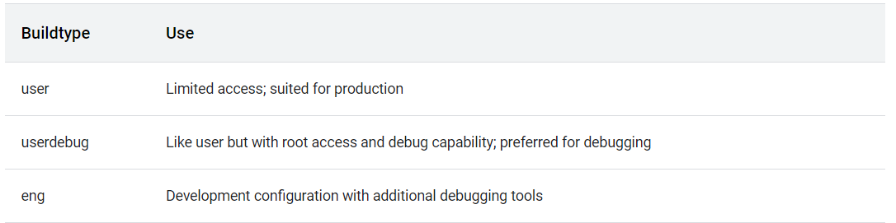

Building Android
================

Follow these instructions to begin building Android.

[Setting up the environment]
----------------------------------------------------------------------------

Initialize the environment with the `envsetup.sh` script:


``` 
source build/envsetup.sh
```

or


``` 
. build/envsetup.sh
```

See the script at
[platform/build/envsetup.sh](https://android.googlesource.com/platform/build/+/refs/heads/master/envsetup.sh)
for descriptions of related commands, including
[lunch](https://source.android.com/setup/build/building#lunch) for
selecting device targets and
[tapas](https://source.android.com/setup/build/building#tapas) for
building unbundled apps, such as the [reference TV
app](https://source.android.com/devices/tv/reference-tv-app).

You need to reissue this command after every `repo sync` to pick up any changes to that script. Note that replacing
`source` (a
single dot) saves a few characters, and the short form is more commonly
used in documentation.

The `envsetup.sh` script imports several
commands that enable you to work with the Android source code, including
the commands used in this exercise.

To see the full list of available commands, run:


``` 
hmm
```

[Choosing a target]
-------------------------------------------------------------------

### [lunch]

Choose which target to build with `lunch`.
`lunch   product_name-build_variant` selects
`product_name` as the product to build, and
`build_variant` as the variant to build, and
stores those selections in the environment to be read by subsequent
invocations of `m` and other similar commands.

The exact configuration can be passed as an argument. For example, the
following command refers to a complete build for the emulator, with all
debugging enabled:


``` 
lunch aosp_arm-eng
```

If run with no arguments, `lunch` prompts you
to choose a target from the menu. See [Selecting a device
build](https://source.android.com/setup/build/running#selecting-device-build)
for the build configurations of all existing devices.

All build targets take the form `BUILD-BUILDTYPE`, where `BUILD` is a codename
referring to the particular feature combination.
`BUILDTYPE` is one of the following.



The userdebug build should behave the same as the user build, with the
ability to enable additional debugging that normally violates the
security model of the platform. This makes the userdebug build good for
user testing with greater diagnosis capabilities. When developing with
the userdebug build, follow the [userdebug
guidelines](https://source.android.com/setup/develop/new-device#userdebug-guidelines).

The eng build prioritizes engineering productivity for engineers who
work on the platform. The eng build turns off various optimizations used
to provide a good user experience. Otherwise, the eng build has behavior
similar to the user and userdebug builds so that device developers can
see how the code behaves in those environments.

For more information about building for and running on actual hardware,
see [Flashing Devices](https://source.android.com/setup/build/running).

### [tapas]

The `tapas` command configures the build of
unbundled apps. It selects individual apps to be built by the Android
build system. Unlike `lunch`,
`tapas` does not request the building of
images for a device.

Run `tapas help` for more information on the
command.

[Building the code]
-------------------------------------------------------------------

This section is a quick summary to ensure that setup is complete.

Build everything with `m`. `m` can handle parallel tasks with a `-jN` argument. If you don\'t provide a `-j` argument, the build system automatically selects a parallel
task count that it thinks is optimal for your system.


``` 
m
```

As explained above, you can build specific modules instead of the full
device image by listing their names in your `m` command line. In addition, `m`
provides some pseudotargets for special purposes. Some examples are:

-   **`droid`** - `m droid` is the normal build. This target is here because the
    default target requires a name.
-   **`all`** - `m all` builds everything that `m droid` does, plus everything that doesn\'t have the
    `droid` tag. The build server runs this to
    make sure that everything that is in the tree and has an
    `Android.mk` file builds.
-   **`m`** - Runs builds from the top of the
    tree. This is useful because you can run `make` from within subdirectories. If you have the
    `TOP` environment variable set, it uses
    that. If you don\'t, it looks up the tree from the current
    directory, trying to find the top of the tree. You can either build
    the whole source code tree by running `m`
    without arguments or build specific targets by specifying their
    names.
-   **`mma`** - Builds all of the modules in
    the current directory, and their dependencies.
-   **`mmma`** - Builds all of the modules in
    the supplied directories, and their dependencies.
-   **`croot`** - `cd` to the top of the tree.* - `m clean`{translate="no" deletes all of the output and intermediate files for this
    configuration. This is the same as `rm -rf out/`{translate="no"
    dir="ltr"}.

Run `m help` to see what other pseudotargets
`m` provides.

[Running the build]
-------------------------------------------------------------------

You can either run your build on an emulator or flash it on a device.
Because you\'ve already selected your build target with
`lunch`, it\'s unlikely to run on a different
target than it was built for.

**Note:** Remember to obtain proprietary binaries or your build won\'t
boot successfully on your target hardware. Sometimes the source might
have different binaries for different builds and branches. If you obtain
binary blobs at this point, you need to unpack them,
`m installclean`, and rebuild. For more
information on this process, see [Obtaining proprietary
binaries](https://source.android.com/setup/build/downloading#obtaining-proprietary-binaries).

### [Flashing with fastboot]

To flash a device, use `fastboot`, which
should be included in your path after a successful build. See [Flashing
a
device](https://source.android.com/setup/build/running#flashing-a-device)
for instructions.

### [Emulating an Android device]

The emulator is added to your path automatically by the build process.
To run the emulator, type:


``` 
emulator
```

[Understanding build fingerprints]
----------------------------------------------------------------------------------

To track and report issues tied to a particular Android build, it is
important to understand the build fingerprint. The build fingerprint is
a unique, human-readable string containing manufacturer information
issued to each build. See the *FINGERPRINT* description within the
[Build
Parameters](https://source.android.com/compatibility/android-cdd#3_2_2_build_parameters)
section of the Android Compatibility Definition Document (CDD) for the
precise syntax.

The build fingerprint represents a particular Android implementation and
revision. This unique key allows app developers and others to report
issues with specific firmware versions. See [Reporting
Bugs](https://source.android.com/setup/contribute/report-bugs) for the
Android issue-reporting process.

A build fingerprint encapsulates all Android implementation details:

-   APIs: Android and native, as well as soft API behaviors
-   Core API and some system UI behavior
-   Compatibiility and security requirements defined in the CDD
-   Product specifications and the
    [uses-feature](https://developer.android.com/guide/topics/manifest/uses-feature-element.html)
    setting employed by apps to target devices meeting expected
    requirements
-   Implementations of hardware and software components

See the [CDD](https://source.android.com/compatibility/android-cdd) for
complete details and [Adding a New
Device](https://source.android.com/setup/develop/new-device) for
instructions on creating an entirely new Android device.

[Troubleshooting common build errors]
-------------------------------------------------------------------------------------

### [Wrong Java version]

If you\'re attempting to build a version of Android that\'s inconsistent
with your version of Java, `make` aborts with
a message such as:


``` 
************************************************************
You are attempting to build with the incorrect version
of java.

Your version is: WRONG_VERSION.
The correct version is: RIGHT_VERSION.

Please follow the machine setup instructions at
    https://source.android.com/source/initializing.html
************************************************************
```

Here are the likely causes and solutions:

-   Failure to install the correct JDK as specified in the [JDK
    requirements](https://source.android.com/setup/build/requirements#jdk).
    Make sure you\'ve followed the steps in [Setting up the
    environment](https://source.android.com/setup/build/building#initialize)
    and [Choosing a
    target](https://source.android.com/setup/build/building#choose-a-target).
-   Another JDK previously installed appearing in your path. Prepend the
    correct JDK to the beginning of your path or remove the problematic
    JDK.

### [No USB permission]

By default on most Linux systems, unprivileged users can\'t access USB
ports. If you see a permission denied error, follow the instructions in
[Configuring USB
access](https://source.android.com/setup/build/initializing#configuring-usb-access).

If [ADB](https://source.android.com/setup/build/adb) was already running
and can\'t connect to the device after getting those rules set up, you
can kill it with `adb kill-server`. That
command causes ADB to restart with the new configuration.
