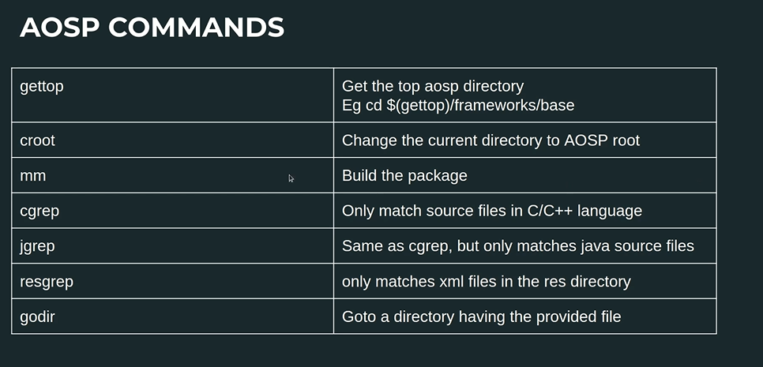
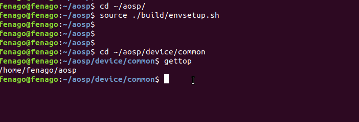
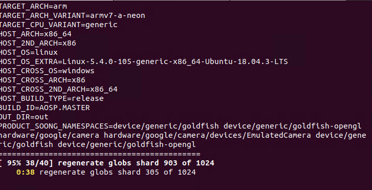
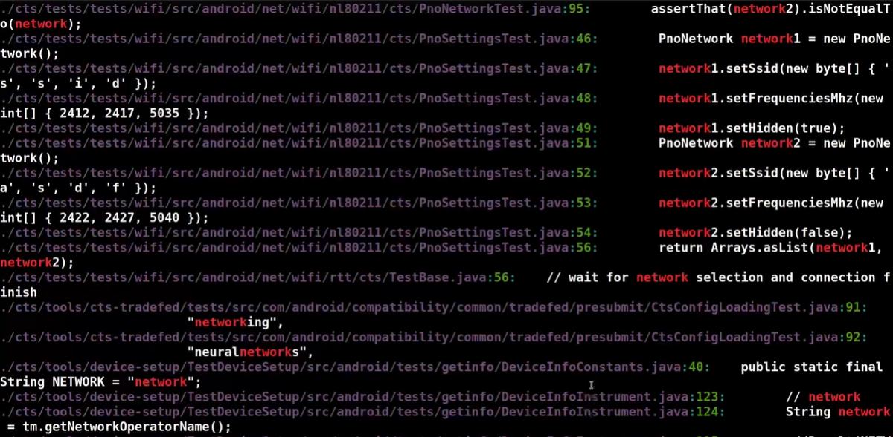
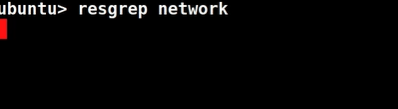

#### Lab: Common AOSP Commands

In this lab, we will learn some of the AOSP commands which are pretty useful when you work with the terminal window. 


**Note:**

Initialize the environment with the `envsetup.sh` script:

```
cd ~/aosp

source build/envsetup.sh
```


Here are some of common AOSP commands:



The first one here is the `gettop` command so this basically prints the top **aosp directory**. Let's quickly try this in the terminal window. Go to the `device/common` folder, type `gettop` that prints the top aosp folder.

```
cd ~/aosp/device/common

gettop
```



Right? From this particular path I am in `device/common` folder, right? If I need to go directly to another folder, go to `frameworks/base`. So I could simply use cd $(gettop) will print you the top folder path and from there you put a /framework/base.

```
cd $(gettop)/frameworks/base
```

So execute this command, check the path. You are already in the framework/base. So this is a typical use case where you could make use of this gettop command.
Simply typing gettop will bring you top aosp folder. Similarly, if you wanted to go back to `device/common` folder then you can do as follows:

```
cd $(gettop)/device/common
```

Now, let's look at the croot command. We can change current directory to aosp root with the help of this command. Type `croot` in the terminal and you should be back in aosp root folder:

```
croot

pwd
```

Let's do another example. Go to `build/blueprint` folder:

```
cd ~/aosp/build/blueprint
```

Type `croot` in the terminal again and you should be back in aosp root folder.

```
croot

pwd
```


Next command is `mm`. So, `mm` command is basically build the package in the current folder. Now, from aosp, let's go to `packages/apps/HTMLViewer` folder:

```
cd ~/aosp/packages/apps/HTMLViewer

ls
```

Let's open `AndroidManifest.xml` and add a new blank line and save it. Now type `mm` command in the terminal, it will only build the HTMLViewer app. From the logs, you can see that it is only building HTMLViewer app.



Next, we have `cgrep`, `jgrep` and `resgrep` commands. `cgrep` is only for C/C++ files. `jgrep` is only for java source files and `resgrep` is only for xml files in the res directory.

Let's first use `cgrep` command by typing following command in the terminal:

`cgrep network`

Siilarly, let's try the `jgrep` command by typing following command in the terminal:

`jgrep network`



As you can see, these are all java files. Now, let's try `resgrep` command:

`resgrep network`



Another useful command is `godir`. It will help you go to a directory having the provided file.

`godir SystemServer.java`

Now, you should be in the directory where `SystemServer.java` exists: `pwd`

Fom here, if you want to go to `SystemUI.java`, enter following command in the terminal:

`godir SystemUI.java`
