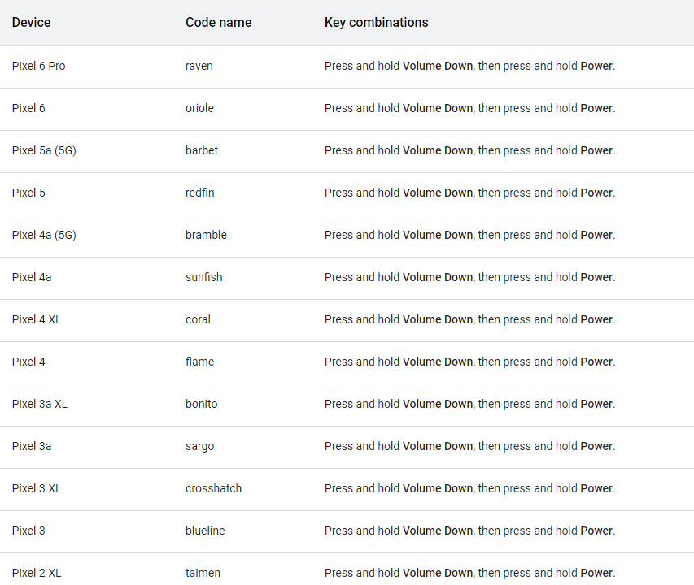
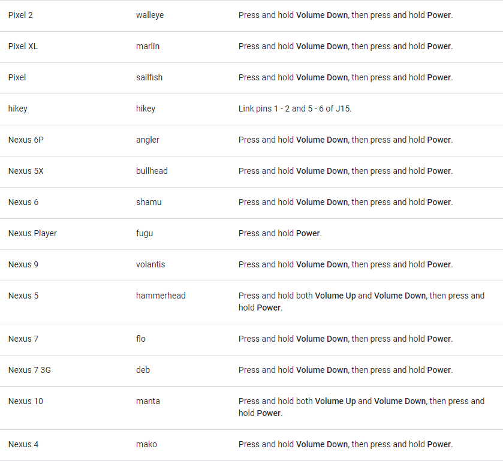
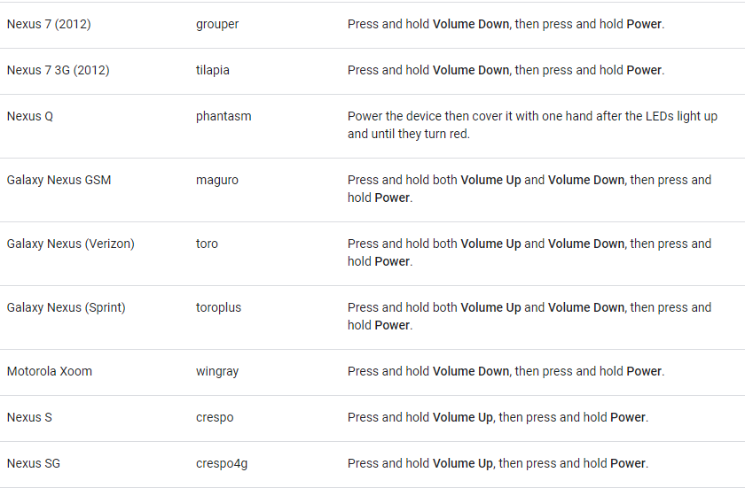
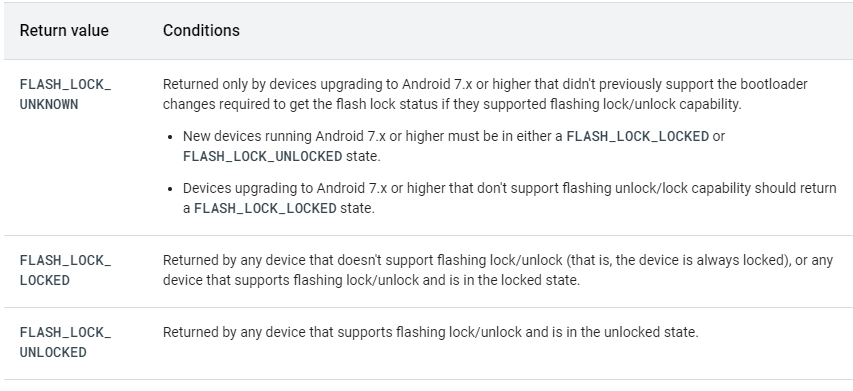

Flashing Devices
================


This page provides details for running builds on specific devices. These
details complement the information in [Building
Android](https://source.android.com/setup/build/building).

**Note:** You can flash an existing build from the [Android Continuous
Integration](https://ci.android.com/) dashboard with the
[Android Flash Tool](https://flash.android.com/). For details
see the [Android Flash
Tool](https://source.android.com/setup/contribute/flash) page.

[Building fastboot and adb]
---------------------------------------------------------------------------

If you don\'t already have `fastboot` and
`adb`, you can build them with the regular
build system. Use the instructions in [Building
Android](https://source.android.com/setup/build/building) and replace
the main `make` command with this one:


``` 
make fastboot adb
```

See [Android Debug Bridge
(ADB)](https://source.android.com/setup/build/adb) for details on
Android Debug Bridge (ADB).

[Booting into fastboot mode]
----------------------------------------------------------------------------

You can flash a device when it\'s in the `fastboot` bootloader mode. To enter `fastboot` mode when a device is undergoing a cold boot, use the [key
combinations](https://source.android.com/setup/build/running#keys) given
in the table below.

You can also use the command `adb reboot bootloader` to reboot directly into the bootloader. See [Flashing
instructions](https://developers.google.com/android/images#instructions)
for full instructions.








[Unlocking the bootloader]
--------------------------------------------------------------------------

You can flash a custom system only if the bootloader allows it. Note,
though, that the bootloader is locked by default. You can unlock the
bootloader, but doing so deletes user data for privacy reasons. After
unlocking, *all* data on the device is erased, that is, both private app
data and shared data accessible over USB (including photos and movies).
Before attempting to unlock the bootloader, back up any important files
on the device.

You need to unlock the bootloader only once, and you can re-lock it if
necessary.

### [Unlocking recent devices]

All Nexus and Pixel devices released since 2014 (starting with Nexus 6
and Nexus 9) have factory-reset protection and require a multistep
process to unlock the bootloader.

1.  To enable OEM unlocking on the device:
    1.  In Settings, tap **About phone**, then tap **Build number**
        seven times.
    2.  When you see the message *You are now a developer!*, tap the
        **back** button.
    3.  In Settings, tap **System**, then tap **Developer options** and
        enable **OEM unlocking** and **USB debugging**. (If **OEM
        unlocking** is disabled, connect to the internet so the device
        can check in at least once. If it remains disabled, your device
        might be SIM locked by your carrier and the bootloader can\'t be
        unlocked.)
2.  Reboot into the bootloader and use `fastboot` to unlock it.
    -   For newer devices (2015 and higher):

        
        :::

        ``` 
        fastboot flashing unlock
        ```

    -   For older devices (2014 and lower):

        
        :::

        ``` 
        fastboot oem unlock
        ```

    Tip: if you\'re seeing \`adb devices\` output before reboot but
    fastboot or the flash script are misbehaving, it might be issues
    with your USB cable. Try a different port and/or switching
    connectors. If you are using a USB C port on your computer try a USB
    A port instead.
3.  Confirm the unlock onscreen.

**Note:** On Nexus 10, after unlocking the bootloader, the internal
storage remains unformatted. You can format the device using
`fastboot format cache` followed by
`fastboot format userdata`.

### [Re-locking the bootloader]

To re-lock the bootloader:

-   For newer devices (2015 and higher):

    

    ``` 
    fastboot flashing lock
    ```

-   For older devices (2014 and lower):

    

    ``` 
    fastboot oem lock
    ```

**Note:** Re-locking the bootloading on a Motorola Xoom erases all user
data (including the shared USB data).

[Using flash lock states]
-------------------------------------------------------------------------

The `getFlashLockState()` system API transmits
the bootloader state and the
`PersistentDataBlockManager.getFlashLockState()` system API returns the bootloader's lock status on compliant
devices.



Manufacturers should test the values returned by devices with locked and
unlocked bootloaders. For an example, the Android Open Source Project
(AOSP) contains a reference implementation that returns a value based on
the `ro.boot.flash.locked` boot property.
Example code is located in the following directories:

-   `frameworks/base/services/core/java/com/android/server/PersistentDataBlockService.java`s/base/core/java/android/service/persistentdata/PersistentDataBlockManager.java`{translate="no"
    dir="ltr"}

[Selecting a device build]
--------------------------------------------------------------------------

The recommended device builds are available from the
`lunch` menu, accessed when running the
`lunch` command with no arguments. See
[Choosing a
target](https://source.android.com/setup/build/building#choose-a-target)
for available build types and more information on the
`lunch` command.

You can download factory images and binaries for Pixel and Nexus devices
from [developers.google.com](https://developers.google.com/).
See [Device
binaries](https://source.android.com/setup/build/requirements#binaries)
for downloads. For details and additional resources, see [Obtaining
proprietary
binaries](https://source.android.com/setup/build/downloading#obtaining-proprietary-binaries).


```
  Device                        Code name             Build configuration
  ----------------------------- ---------------------  --------------------- 
  Pixel 6 Pro                   raven                 `aosp_raven-userdebug`
  Pixel 6                       oriole                `aosp_oriole-userdebug`
  Pixel 5                       redfin                `aosp_redfin-userdebug`
  Pixel 4a 5G                   bramble               `aosp_bramble-userdebug`
  Pixel 4a                      sunfish               `aosp_sunfish-userdebug`
  Pixel 4 XL                    coral                 `aosp_coral-userdebug`
  Pixel 4                       flame                 `aosp_flame-userdebug`
  Pixel 3a XL                   bonito                `aosp_bonito-userdebug`
  Pixel 3a                      sargo                 `aosp_sargo-userdebug`
  Pixel 3 XL                    crosshatch            `aosp_crosshatch-userdebug`
  Pixel 3                       blueline              `aosp_blueline-userdebug`
  Pixel 2 XL                    taimen                `aosp_taimen-userdebug`
  Pixel 2                       walleye               `aosp_walleye-userdebug`
  Pixel XL                      marlin                `aosp_marlin-userdebug`
  Pixel                         sailfish              `aosp_sailfish-userdebug`
  HiKey                         hikey                 `hikey-userdebug`
  Nexus 6P                      angler                `aosp_angler-userdebug`
  Nexus 5X                      bullhead              `aosp_bullhead-userdebug`
  Nexus 6                       shamu                 `aosp_shamu-userdebug`
  Nexus Player                  fugu                  `aosp_fugu-userdebug`
  Nexus 9                       volantis (flounder)   `aosp_flounder-userdebug`
  Nexus 5 (GSM/LTE)             hammerhead            `aosp_hammerhead-userdebug`
  Nexus 7 (Wi-Fi)               razor (flo)           `aosp_flo-userdebug`
  Nexus 7 (Mobile)              razorg (deb)          `aosp_deb-userdebug`
  Nexus 10                      mantaray (manta)      `full_manta-userdebug`
  Nexus 4                       occam (mako)          `full_mako-userdebug`
  Nexus 7 (Wi-Fi)               nakasi (grouper)      `full_grouper-userdebug`
  Nexus 7 (Mobile)              nakasig (tilapia)     `full_tilapia-userdebug`
  Galaxy Nexus (GSM/HSPA+)      yakju (maguro)        `full_maguro-userdebug`
  Galaxy Nexus (Verizon)        mysid (toro)          `√aosp_toro-userdebug`
  Galaxy Nexus (Experimental)   mysidspr (toroplus)   `aosp_toroplus-userdebug`
  Motorola Xoom (U.S. Wi-Fi)    wingray               `full_wingray-userdebug`
  Nexus S                       soju (crespo)         `full_crespo-userdebug`
  Nexus S 4G                    sojus (crespo4g)      `full_crespo4g-userdebug`
```

**Note:** Don\'t use Android 4.1.1 on a Nexus 7 originally sold with
Android 4.1.2 or higher.

[Flashing a device]
-------------------------------------------------------------------

You can flash an entire Android system in a single command; doing so
verifies that the system being flashed is compatible with the installed
bootloader and radio, writes the boot, recovery, and system partitions
together, then reboots the system. Flashing also erases all user data,
similarly to `fastboot oem unlock`.

To flash a device:

1.  Place the device in `fastboot` mode by
    holding the appropriate key combination at boot or using the
    following command:

    

    ``` 
    adb reboot bootloader
    ```

2.  After the device is in fastboot mode, run:

    

    ``` 
    fastboot flashall -w
    ```

    The `-w` option wipes the
    `/data` partition on the device; this is
    useful for your first time flashing a particular device but is
    otherwise unnecessary.

**Note:** File systems created with `fastboot`
on Motorola Xoom don\'t function optimally. The Android team recommends
that you recreate file systems through recovery using
`$ adb reboot recovery`. While in recovery,
open the menu (press **Power + Volume Up**), wipe the cache partition,
then wipe the data.

[Restoring devices to factory state]
------------------------------------------------------------------------------------

Factory images for Google devices are available from [Factory Images for
Nexus and Pixel
Devices](https://developers.google.com/android/nexus/images).
Factory images for the Motorola Xoom are distributed directly by
Motorola.
