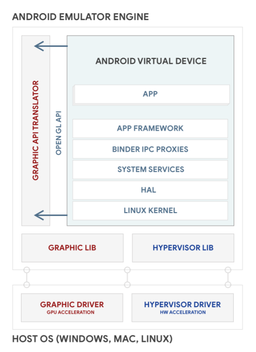

Using Android Emulator Virtual Devices
======================================

You can use Android Emulator to create emulations of Android devices
that run your own custom Android system images. You can also share your
custom Android system images so that other people can run emulations of
them. In addition, you can add multi-display support to Android Emulator
emulations.

Android Emulator architecture
-------------------------------------------------------------------------------

Android Emulator allows you to run emulations of Android devices on
Windows, macOS or Linux machines. The Android Emulator runs the Android
operating system in a virtual machine called an Android Virtual Device
(AVD). The AVD contains the full [Android software
stack](https://source.android.com/devices/architecture), and it runs as
if it were on a physical device. Figure 1 is a diagram of the Android
Emulator\'s high-level architecture. For more information about the
emulator, see [Run apps on the Android
Emulator](https://developer.android.com/studio/run/emulator){.external}.



**Figure 1.** Android Emulator architecture

[Building AVD images]
---------------------------------------------------------------------

Each AVD includes an Android system image, which runs in that AVD. The
AVD Manager includes some system images. And you can build custom AVD
system images from your source code and create device emulations to run
them.

**Note:** You need to [establish a build
environment](https://source.android.com/setup/build/initializing) before
building AVD system images.

To build and run an AVD system image:

1.  Download the Android source:

    
    

    ```
    mkdir aosp-master; cd aosp-master
    repo init -u
    repo sync -j24
    ```

    If you want to build other Android versions, you can find their
    branch names in the [public Android
    repository](https://android.googlesource.com/platform/manifest/+refs).
    They map to [Android Codenames, Tags, and Build
    Numbers](https://source.android.com/setup/start/build-numbers#source-code-tags-and-builds).

2.  Build an AVD system image. This is the same process as [building an
    Android](https://source.android.com/setup/build/building) device
    system image. For example, to build a x86 32-bit AVD:

    
    

    ```
    mkdir aosp-master; cd aosp-master
    source ./build/envsetup.sh
    lunch sdk_phone_x86
    make -j32
    ```

    If you prefer to build an x86 64-bit AVD, run `lunch` for the 64-bit target:

    
    

    ```
    lunch sdk_phone_x86_64
    ```

3.  Run the AVD system image in the Android Emulator:

    
    

    ```
    emulator
    ```

See the [Command-line startup
options](https://developer.android.com/studio/run/emulator-commandline#startup-options)
for more details about running the emulator. Figure 2 shows an example
of the Android Emulator running an AVD.


**Figure 2.** Android Emulator running an AVD
