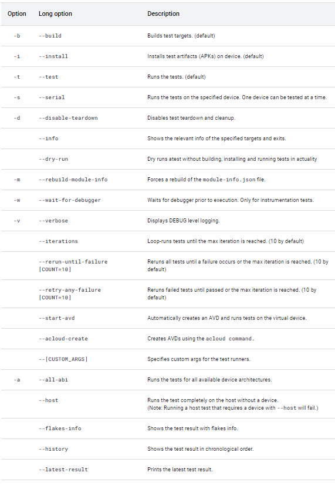

Lab: Atest
----------

Atest is a command line tool that allows users to build, install, and
run Android tests locally, greatly speeding test re-runs. This lab explains
how to use Atest to run Android tests.


[Setting up your environment]
-----------------------------------------------------------------------------

To run Atest, follow the steps in the sections below to set up your
environment.


### [Run envsetup.sh]

From the root of the Android source checkout, run:


```
source build/envsetup.sh
```

### [Run lunch]

Run the `lunch` command to bring up a menu of
supported devices. Find the device and run that command.

For example, if you have an ARM device connected, run the following
command:


```
lunch aosp_arm64-eng
```

This sets various environment variables required for running Atest and
adds the Atest command to your `$PATH`.

[Basic usage]
-------------------------------------------------------------

Atest commands take the following form:


```
atest test-to-run [optional-arguments]
```

### [Optional arguments]

Below are the most commonly used arguments. A complete list is available
through `atest --help`.



### [Tests to run]

You can run one or more tests using `test-to-run`{.variable
translate="no"}. To run multiple tests, separate test references with
spaces. For example:


```
atest test-to-run-1 test-to-run-2
```

Here are some examples:


```
atest FrameworksServicesTests
atest example/reboot
atest FrameworksServicesTests CtsVideoTestCases
atest FrameworksServicesTests:ScreenDecorWindowTests
```


[Identifying tests]
-------------------------------------------------------------------

You can specify the `test-to-run` argument
with the test\'s module name, Module:Class, class name, TF integration
test, file path or package name.

### [Module name]

To run an entire test module, use its module name. Input the name as it
appears in the `LOCAL_MODULE` or
`LOCAL_PACKAGE_NAME` variables in that test\'s
`Android.mk` or `Android.bp`{translate="no"
dir="ltr"} file.

**Note:** Use **TF Integration Test** to run non-module tests integrated
directly into TradeFed.

Examples:


```
atest FrameworksServicesTests
atest CtsVideoTestCases
```

### [Module:Class]

To run a single class within a module, use **Module:Class**. **Module**
is the same as described in [Module
name].
**Class** is the name of the test class in the `.java`{translate="no"
dir="ltr"} file and can be the fully qualified class name or the basic
name.

Examples:


```
atest FrameworksServicesTests:ScreenDecorWindowTests
atest FrameworksServicesTests:com.android.server.wm.ScreenDecorWindowTests
atest CtsVideoTestCases:VideoEncoderDecoderTest
```

### [Class name]

To run a single class without explicitly stating a module name, use the
class name.

Examples:


```
atest ScreenDecorWindowTests
atest VideoEncoderDecoderTest
```

Using the **Module:Class** reference is recommended whenever possible
since Atest requires more time to search the complete source tree for
potential matches if no module is stated.

Examples (ordered from fastest to slowest):


```
atest FrameworksServicesTests:com.android.server.wm.ScreenDecorWindowTests
atest FrameworksServicesTests:ScreenDecorWindowTests
atest ScreenDecorWindowTests
```

### [TF integration test]

To run tests that are integrated directly into TradeFed (non-modules),
input the name as it appears in the output of the
`tradefed.sh list configs` command. For
example:

To run the [`reboot.xml`
test](https://android.googlesource.com/platform/tools/tradefederation/contrib/+/master/res/config/example/reboot.xml):


```
atest example/reboot
```

To run the [`native-benchmark.xml`
test](https://android.googlesource.com/platform/tools/tradefederation/+/master/res/config/native-benchmark.xml):


```
atest native-benchmark
```

### [File path]

You can run both module-based tests and integration-based tests by
inputting the path to their test file or directory as appropriate. You
can also run a single class by specifying the path to the class\'s Java
file. Both relative and absolute paths are supported.

Example: Two ways to run the `CtsVideoTestCases`{translate="no"
dir="ltr"} module via path

1.  Run module from Android `repo-root`:

    
    

    ```
    atest cts/tests/video
    ```

2.  From Android `repo-root`/cts/tests/video:

    
    

    ```
    atest .
    ```

Example: Run a specific class within `CtsVideoTestCases`{translate="no"
dir="ltr"} module via path. From Android `repo-root`{.variable
translate="no"}:

```
atest cts/tests/video/src/android/video/cts/VideoEncoderDecoderTest.java
```

Example: Run an integration test via path. From Android
`repo-root`:

```
atest tools/tradefederation/contrib/res/config/example/reboot.xml
```

### Package name

Atest supports searching tests by package name.

Examples:

```
atest com.android.server.wm
atest com.android.uibench.janktests
```

Specifying steps: Build, install, or run
----------------------------------------

You can specify which steps to run by using the `-b`{translate="no"
dir="ltr"}, `-i`, and `-t`{translate="no"
dir="ltr"} options. If you don\'t specify an option, then all steps run.

**Note:** You can run `-b` and
`-t` alone, but `-i`
needs `-t` to run.

-   Build targets only: `atest -b test-to-run`
-   Run tests only: `atest -t test-to-run`
-   Install apk and run tests: `atest -it test-to-run`{translate="no"
    dir="ltr"}
-   Build and run, but don\'t install:
    `atest -bt test-to-run`

Atest can force a test to skip the cleanup/teardown step. Many tests,
such as CTS, clean up the device after the test is run, so trying to
rerun your test with `-t` will fail without
the `--disable-teardown` parameter. Use
`-d` before `-t` to
skip the test clean up step and test iteratively.

```
atest -d test-to-run
atest -t test-to-run
```

**Note:** `-t` disables both **setup/install**
and **teardown/cleanup** of the device so you can rerun your test with
`atest -t test-to-run` as many times as you
want.

Running specific methods
------------------------

You can run specific methods within a test class. Although the whole
module needs to be built, this reduces the time needed to run the tests.
To run specific methods, identify the class using any of the ways
supported for identifying a class (Module:Class, file path, etc) and
append the name of the method.

```
atest reference-to-class#method1
```

You can specify multiple methods with commas.

```
atest reference-to-class#method1,method2,method3
```

Examples:

```
atest com.android.server.wm.ScreenDecorWindowTests#testMultipleDecors
atest FrameworksServicesTests:ScreenDecorWindowTests#testFlagChange,testRemoval
```

The following two examples show the preferred ways to run a single
method, `testFlagChange`. These examples are
preferred over only using the class name because specifying the module
or the Java file location allows Atest to find the test much faster:

1.  Using Module:Class

    ```
    atest FrameworksServicesTests:ScreenDecorWindowTests#testFlagChange
    ```

2.  From Android `repo-root`

    ```
    atest frameworks/base/services/tests/wmtests/src/com/android/server/wm/ScreenDecorWindowTests.java#testFlagChange
    ```

Multiple methods can be run from different classes and modules:

```
atest FrameworksServicesTests:ScreenDecorWindowTests#testFlagChange,testRemoval ScreenDecorWindowTests#testMultipleDecors
```

Running multiple classes
------------------------

To run multiple classes, separate them with spaces in the same way as
running multiple tests. Atest builds and runs classes efficiently, so
specifying a subset of classes in a module improves performance over
running the whole module.

Examples:

-   Two classes in the same module:

    ```
    atest FrameworksServicesTests:ScreenDecorWindowTests FrameworksServicesTests:DimmerTests
    ```

-   Two classes in different modules:

    ```
    atest FrameworksServicesTests:ScreenDecorWindowTests CtsVideoTestCases:VideoEncoderDecoderTest
    ```

Running native tests
--------------------

Atest can run native tests. Use `-a` to run
the tests for all available device architectures, which in this example
are armeabi-v7a (ARM 32-bit) and arm64-v8a (ARM 64-bit).

Examples:

-   Input tests:

    ```
    atest -a libinput_tests inputflinger_tests
    ```

**Note:** If only need to run tests for a specific ABI, use
`atest -- --abi arm64-v8a` or
`atest -- --abi armeabi-v7a`

To select a specific native test to run, use colon (:) to specify the
test name and hashtag (\#) to further specify an individual method. For
example, for the following test definition:

```
TEST_F(InputDispatcherTest, InjectInputEvent_ValidatesKeyEvents)
```

You can run the entire test using

```
atest inputflinger_tests:InputDispatcherTest
```

or an individual test method using

```
atest inputflinger_tests:InputDispatcherTest#InjectInputEvent_ValidatesKeyEvents
```

Running tests in TEST\_MAPPING
------------------------------

Atest can run tests in TEST\_MAPPING files.

1.  Run presubmit tests implicitly in TEST\_MAPPING files in current,
    parent or specific directories.

    Run presubmit tests in TEST\_MAPPING files in current and parent
    directories:

    ```
    atest
    ```

    Run presubmit tests in TEST\_MAPPING files in
    `/path/to/project` and its parent
    directories:

    ```
    atest --test-mapping /path/to/project
    ```

2.  Run a specified **test group** in TEST\_MAPPING files; available
    test groups are: `presubmit`(default),
    `postsubmit`,
    `mainline-presubmit` and
    `all`.

    -   Run postsubmit tests in TEST\_MAPPING files in current and
        parent directories:

        ```
        atest :postsubmit
        ```

    -   Run tests from all groups in TEST\_MAPPING files:

        ```
        atest :all
        ```

    -   Run postsubmit tests in TEST\_MAPPING files in
        `/path/to/project` and its parent
        directories

        ```
        atest --test-mapping /path/to/project:postsubmit
        ```

    -   Run mainline tests in TEST\_MAPPING files in
        `/path/to/project` and its parent
        directories

        ```
        atest --test-mapping /path/to/project:mainline-presubmit
        ```

3.  Run tests in TEST\_MAPPING files including sub-directories.

By default, atest only searches for tests in TEST\_MAPPING files
upwards(from the current or the given to its parent directories). If you
also want to run tests in TEST\_MAPPING files in the sub-directories,
you can use option `--include-subdirs` to
force atest to include those tests as well.

Run presubmit tests in TEST\_MAPPING files in the current, parent and
sub-directories:

```
atest --include-subdirs /path/to/project
```

Running tests in iteration
--------------------------

To run tests in iteration, simply pass the `--iterations`{translate="no"
dir="ltr"} argument. Whether it passes or fails, atest won\'t stop
testing until the max iteration is reached.

Examples:

By default atest iterates 10 times, giving an integer to change the
round of iteration.

```
atest test-to-run --iterations
atest test-to-run --iterations 5
```

Two approaches that assist users to detect flaky tests:

Approach 1: Run all tests until a failure occurs or the max iteration is
reached.

-   Stop when a failure occurs or the iteration reaches the 10th (by
    default) round.

    ```
    atest test-to-run --rerun-until-failure
    ```

-   Stop when a failure occurs or the iteration reaches the 100th round.

    ```
    atest test-to-run --rerun-until-failure 100
    ```

Approach 2: Run only failed tests until passed or the max iteration is
reached.

-   Assume `test-to-run` has five test cases
    and one of the tests fails. Run only the failed test 10 times or
    until the test passes.

    ```
    atest test-to-run --retry-any-failure
    ```

-   Stop running the failed test when it passes or reaches the 100th
    round.

    ```
    atest test-to-run --retry-any-failure 100
    ```

Pass options to module
----------------------

Atest is able to pass options to the modules. The brief format in Atest
command line to add TradeFed command line option is

```
atest test-to-run -- [CUSTOM_ARGS]
```

The \[CUSTOM\_ARGS\] should follow the Tradefed command line option
formats.

Examples of passing test module options to target preparers or test
runners defined in test config file:

```
atest test-to-run -- --module-arg module-name:option-name:option-value
atest GtsPermissionTestCases -- --module-arg GtsPermissionTestCases:ignore-business-logic-failure:true
```

Examples of passing options to the runner type or class:

```
atest test-to-run -- --test-arg test-class:option-name:option-value
atest CtsVideoTestCases -- --test-arg com.android.tradefed.testtype.JarHosttest:collect-tests-only:true
```

