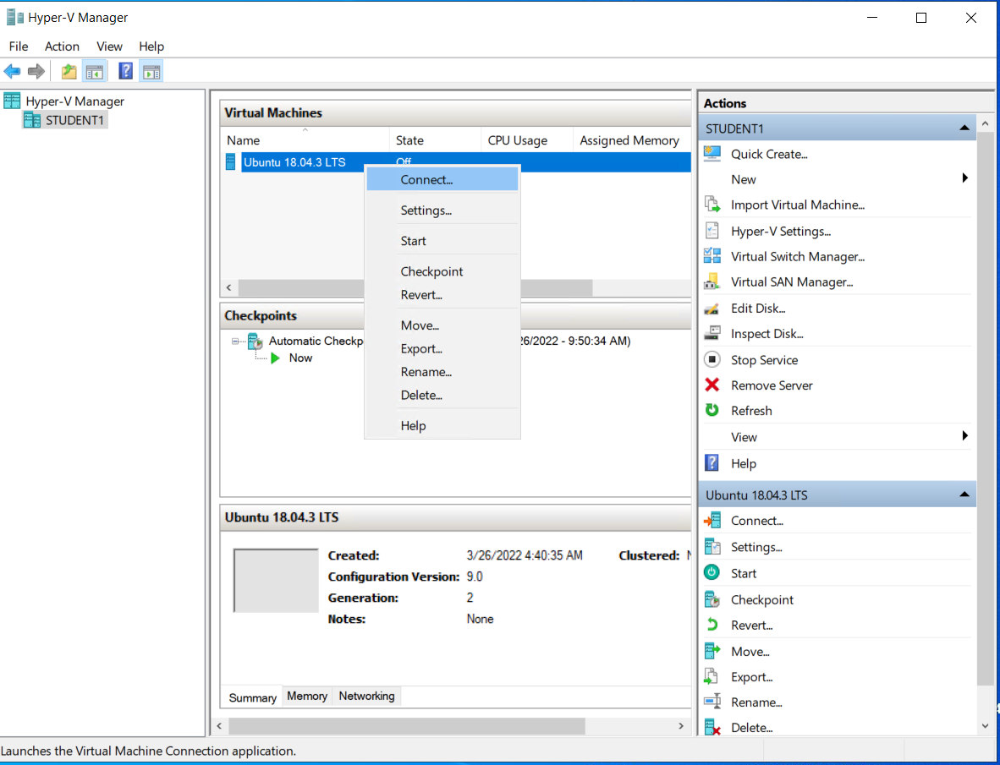
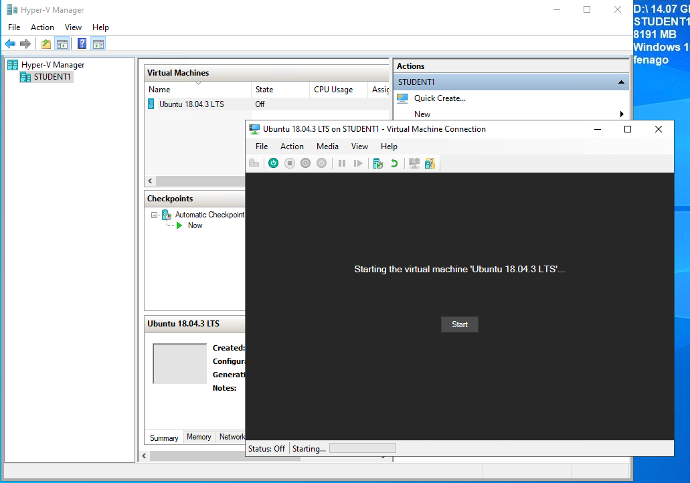
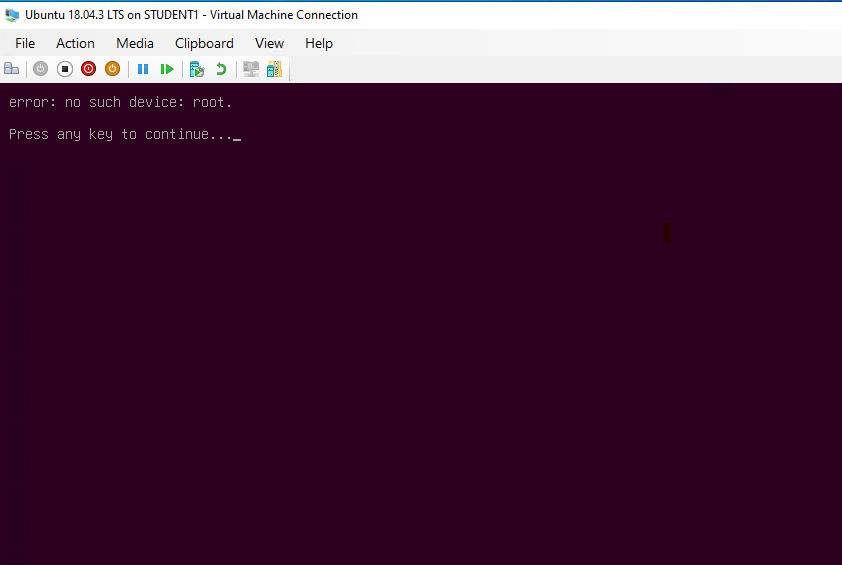
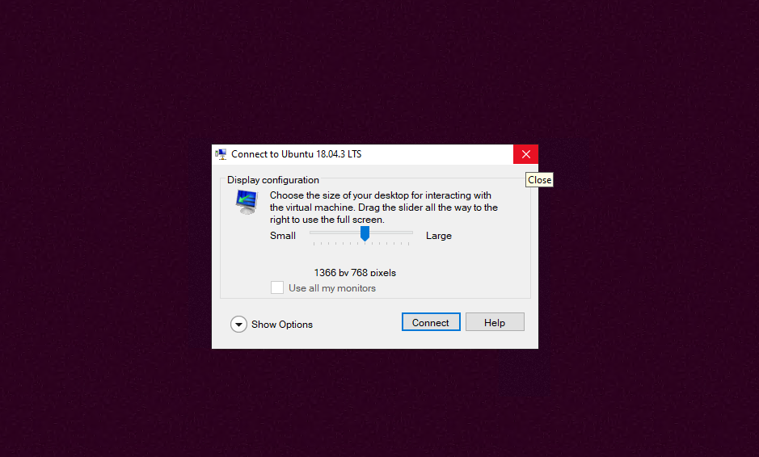

Start Hyper-V Ubuntu VM
========================

Launch **Hyper V** from taskbar. Select **Ubuntu 18.04** VM and right click:

Click **Start** button to start VM:

Press any key to continue:

**Important! Click [X] icon:**

